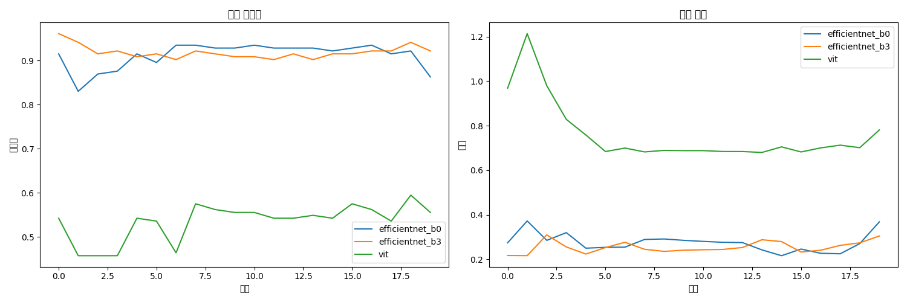
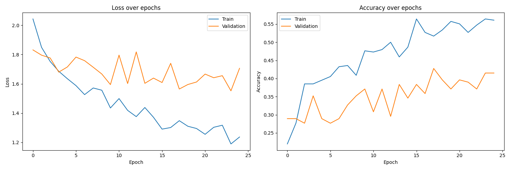
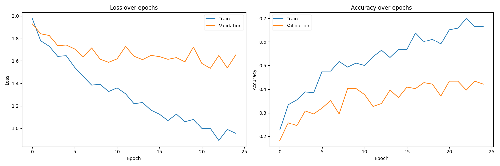

# 전이학습을 통한 이미지 분류 모델 성능 비교 분석

<div align="center">
  
</div>

## 📋 프로젝트 개요

본 프로젝트는 전이학습(Transfer Learning)을 활용하여 두 가지 대표적인 CNN 아키텍처(ResNet50, DenseNet121)의 이미지 분류 성능을 비교 분석합니다. 특히 애니메이션 캐릭터 표정 분류와 Hymenoptera(개미와 벌) 분류 작업에서 각 모델의 성능을 평가하고, 전이학습의 효과와 한계점을 분석합니다.

## 🔍 주요 연구 내용

1. **애니메이션 캐릭터 표정 분류**

   - 7가지 감정 표현(화남, 울음, 당황, 행복, 만족, 슬픔, 충격) 분류
   - ResNet50과 DenseNet121 모델 비교
   - 미세조정(Fine-tuning) 전략 적용

2. **Hymenoptera 데이터셋 분류**
   - 개미와 벌 이미지 분류
   - 최신 모델(EfficientNet, Vision Transformer) 적용
   - 다양한 전이학습 기법 실험

## 📊 실험 결과

### ResNet50 vs DenseNet121 성능 비교

- **정확도**: DenseNet121(43.12%) > ResNet50(40.25%)
- **학습 시간**: ResNet50이 DenseNet121보다 약 15% 빠름
- **과적합**: 두 모델 모두 과적합 문제 발생

<div align="center">
  
  
</div>

## 📁 프로젝트 구조

```
.
├── 01_resnet50_ani_fine_tune.ipynb     # ResNet50 모델 학습 및 평가
├── 02_densenet121_ani_fine_tune.ipynb  # DenseNet121 모델 학습 및 평가
├── 03_advanced_hymenoptera_analysis.ipynb  # Hymenoptera 데이터셋 실험
├── experiment_report.md                # 상세 실험 보고서
├── img/                                # 결과 그래프 및 시각화 자료
├── model/                              # 학습된 모델 저장 디렉토리
└── result/                             # 실험 결과 데이터 저장 디렉토리
```

## 💻 구현 방법론

### 1. 데이터 전처리

```python
data_transforms = {
    'train': transforms.Compose([
        transforms.Resize((224, 224)),
        transforms.RandomHorizontalFlip(),
        transforms.RandomRotation(15),
        transforms.ColorJitter(brightness=0.2, contrast=0.2, saturation=0.2),
        transforms.ToTensor(),
        transforms.Normalize(mean=[0.485, 0.456, 0.406], std=[0.229, 0.224, 0.225])
    ]),
    'val': transforms.Compose([
        transforms.Resize((224, 224)),
        transforms.ToTensor(),
        transforms.Normalize(mean=[0.485, 0.456, 0.406], std=[0.229, 0.224, 0.225])
    ])
}
```

### 2. 모델 구현

```python
# ResNet50 모델 설정
def setup_resnet50(num_classes):
    model = models.resnet50(pretrained=True)

    # 특성 추출기의 파라미터 고정
    for param in model.parameters():
        param.requires_grad = False

    # 분류기 층 수정
    num_ftrs = model.fc.in_features
    model.fc = nn.Sequential(
        nn.Linear(num_ftrs, 512),
        nn.ReLU(),
        nn.Dropout(0.5),
        nn.Linear(512, num_classes)
    )

    return model.to(device)
```

### 3. 학습 설정

- **손실 함수**: Cross-Entropy Loss
- **최적화 알고리즘**: Adam (학습률: 0.001)
- **배치 크기**: 32
- **에폭**: 30
- **조기 종료**: 검증 손실 5회 연속 증가 시

## 🚀 실행 방법

1. 저장소 클론

   ```bash
   git clone https://github.com/J-Draco/Image-Classification-Analysis.git
   cd Image-Classification-Analysis
   ```

2. 필요한 패키지 설치

   ```bash
   pip install torch torchvision tqdm pandas matplotlib timm
   ```

3. 노트북 실행
   - Google Colab에서 실행하는 경우:
     ```python
     from google.colab import drive
     drive.mount('/content/drive')
     ```
   - 로컬에서 실행하는 경우: Jupyter Notebook 또는 JupyterLab 환경에서 노트북 파일(.ipynb) 실행

## 📈 주요 발견점

1. **아키텍처 비교**

   - DenseNet121이 더 높은 정확도를 보이나, 학습 시간은 더 소요됨
   - ResNet50은 더 적은 파라미터로 준수한 성능 달성

2. **전이학습 효과**

   - 사전학습된 가중치 활용 시 학습 속도 및 성능 향상
   - 특징 추출기 고정 후 분류기만 학습하는 방식이 효과적

3. **과적합 문제**
   - 데이터 증강에도 불구하고 과적합 발생
   - 드롭아웃과 조기 종료가 과적합 완화에 도움

## 🔮 향후 연구 방향

1. 더 다양한 CNN 아키텍처(VGG, EfficientNet 등) 비교
2. 하이퍼파라미터 튜닝을 통한 성능 최적화
3. 설명 가능한 AI 기법 적용을 통한 모델 해석
4. 데이터셋 통합 실험을 통한 데이터 확장 효과 분석

## 📝 인용

본 프로젝트를 인용하실 경우 다음 형식을 사용해주세요:

```
@misc{ImageClassificationAnalysis2025,
  author = {J-Draco},
  title = {전이학습을 통한 이미지 분류 모델 성능 비교 분석},
  year = {2025},
  publisher = {GitHub},
  journal = {GitHub repository},
  howpublished = {\url{https://github.com/J-Draco/Image-Classification-Analysis}}
}
```
