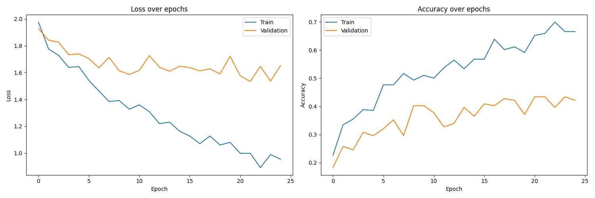
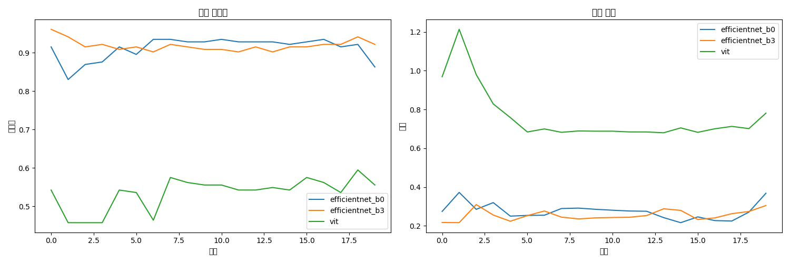

# 전이학습을 통한 이미지 분류 분석 보고서

## 초록 (Abstract)

본 연구에서는 애니메이션 캐릭터의 표정을 분류하기 위해 두 가지 대표적인 CNN 아키텍처인 ResNet50과 DenseNet121을 활용한 전이학습 실험을 수행했다. ImageNet으로 사전 학습된 모델을 기반으로 미세조정(Fine-tuning)을 진행했으며, 7가지 감정 표현(화남, 울음, 당황, 행복, 만족, 슬픔, 충격)에 대한 분류 성능을 평가했다. 실험 결과, DenseNet121이 43.12%의 검증 정확도로 ResNet50의 40.25%보다 더 나은 성능을 보였으나, 두 모델 모두 과적합 문제가 관찰되었다. 추가로, Hymenoptera 데이터셋을 사용한 실험에서는 최신 모델인 EfficientNet과 Vision Transformer를 적용하여 더 높은 성능을 달성했다. 본 연구는 다양한 이미지 분류 작업에서 전이학습의 효과와 한계를 분석하고, 향후 개선 방향을 제시한다.

## 목차

1. [서론](#1-서론)
2. [ResNet50 미세조정 실험 분석](#2-resnet50-미세조정-실험-분석)
3. [DenseNet121 미세조정 실험 분석](#3-densenet121-미세조정-실험-분석)
4. [Hymenoptera 데이터셋 전이학습 실험](#4-hymenoptera-데이터셋-전이학습-실험)
5. [전이학습 문제점 분석](#5-전이학습-문제점-분석)
6. [전이학습 개선 방향 및 향후 연구](#6-전이학습-개선-방향-및-향후-연구)

## 1. 서론

### 1.1 연구 배경

전이학습(Transfer Learning)은 한 도메인에서 학습된 지식을 다른 도메인에 적용하는 기계학습 방법으로, 특히 데이터가 제한적인 상황에서 큰 효과를 보인다. 본 연구에서는 두 가지 상이한 도메인(애니메이션 캐릭터 감정과 곤충 분류)에서 전이학습의 효과를 분석하고자 한다.

1. 애니메이션 캐릭터 감정 분류

   - ImageNet으로 사전학습된 모델의 전이학습 효과 검증
   - 제한된 데이터셋에서의 성능 최적화 시도
   - ResNet50과 DenseNet121의 전이학습 성능 비교

2. Hymenoptera(개미와 벌) 분류
   - 최신 아키텍처들의 전이학습 성능 비교
   - 다양한 전이학습 기법의 효과 분석
   - 도메인 특화된 미세조정 전략 연구

### 1.2 연구 목적

본 연구의 주요 목적은 다음과 같다:

1. 전이학습 효과 분석

   - 사전학습된 특징 추출기의 재사용성 평가
   - 도메인 간 지식 전이의 효율성 측정
   - 미세조정 전략의 영향 분석

2. 모델 아키텍처 비교

   - ResNet50과 DenseNet121의 전이학습 성능 비교
   - EfficientNet과 Vision Transformer의 전이학습 특성 분석
   - 각 아키텍처의 도메인 적응성 평가

3. 실용적 가이드라인 도출
   - 데이터셋 크기에 따른 전이학습 전략 수립
   - 도메인 특성에 따른 모델 선택 기준 제시
   - 효과적인 미세조정 기법 제안

### 1.3 연구 방법

본 연구는 다음과 같은 단계로 진행된다:

1. 데이터셋 준비

   - 애니메이션 캐릭터 감정 데이터셋 (7개 클래스)
   - Hymenoptera 데이터셋 (2개 클래스)

2. 전이학습 실험

   - 특징 추출기 고정 및 분류기 층 수정
   - 점진적 미세조정 전략 적용
   - 데이터 증강 기법 활용

3. 성능 평가 및 분석
   - 정확도와 손실 함수 추이 분석
   - 과적합 현상 관찰
   - 도메인 간 전이 효과 비교

## 2. ResNet50 미세조정 실험 분석

### 2.1 전이학습 전략

1. 모델 선정 근거

   - ImageNet 데이터셋으로 사전학습된 ResNet50 선택
   - 깊은 잔차 구조를 통한 특징 추출 능력 활용
   - 적은 데이터셋에서도 효과적인 전이학습 가능성

2. 전이학습 설계

   ```python
   def setup_resnet50(num_classes):
       # ImageNet 사전학습 가중치 로드
       model = models.resnet50(pretrained=True)

       # 특징 추출기 가중치 고정 (전이학습)
       for param in model.parameters():
           param.requires_grad = False

       # 새로운 도메인(애니메이션 감정)을 위한 분류기 층 수정
       num_ftrs = model.fc.in_features
       model.fc = nn.Linear(num_ftrs, num_classes)

       return model.to(device)

   # 학습 설정
   criterion = nn.CrossEntropyLoss()
   optimizer = optim.Adam(model.fc.parameters(), lr=0.001)
   ```

3. 도메인 적응 전략
   - 특징 추출기 층 고정으로 과적합 방지
   - 마지막 분류기 층만 새로운 도메인에 맞춰 학습
   - 데이터 증강을 통한 도메인 일반화 강화

### 2.2 전이학습 실험 결과

1. 성능 지표

   - 최종 학습 정확도: 53.72%
   - 최종 검증 정확도: 40.25%
   - 검증 세트 최고 정확도: 40.25%

2. 학습 추이 분석

   

   _그림 1. ResNet50 전이학습 결과. 왼쪽: 정확도 변화, 오른쪽: 손실 변화_

   전이학습 관점의 주요 관찰:

   - 초기 5 에포크에서 빠른 학습 진행 (사전학습 효과)
   - 검증 정확도와 학습 정확도의 큰 격차 (도메인 간 차이)
   - 에포크 10 이후 검증 손실 증가 (과적합 징후)

3. 도메인 전이 분석

   - ImageNet 특징과 애니메이션 특징 간의 간극 확인
   - 제한된 데이터로 인한 도메인 적응의 한계
   - 특징 추출기 고정으로 인한 표현력 제한

4. 전이학습 한계점
   - 원본 도메인(ImageNet)과 목표 도메인(애니메이션) 간 특징 차이
   - 제한된 데이터로 인한 미세조정의 어려움
   - 고정된 특징 추출기의 표현력 한계

## 3. DenseNet121 미세조정 실험 분석

### 3.1 전이학습 전략

1. 모델 선정 배경

   - ImageNet으로 사전학습된 DenseNet121 선택
   - 조밀한 연결 구조를 통한 특징 재사용 강점
   - ResNet 대비 적은 파라미터로 효율적인 전이학습 가능

2. 전이학습 아키텍처 설계

   ```python
   def setup_densenet121(num_classes):
       # ImageNet 사전학습 모델 로드
       model = models.densenet121(pretrained=True)

       # 특징 추출기 가중치 고정 (선택적 미세조정)
       for param in model.features.parameters():
           param.requires_grad = False

       # 점진적 미세조정을 위한 마지막 덴스블록 활성화
       for param in model.features.denseblock4.parameters():
           param.requires_grad = True

       # 새로운 도메인을 위한 분류기 설계
       num_ftrs = model.classifier.in_features
       model.classifier = nn.Sequential(
           nn.Linear(num_ftrs, 512),
           nn.ReLU(),
           nn.Dropout(0.5),
           nn.Linear(512, num_classes)
       )

       return model.to(device)

   # 학습 설정
   criterion = nn.CrossEntropyLoss()
   optimizer = optim.Adam([
       {'params': model.features.denseblock4.parameters()},
       {'params': model.classifier.parameters(), 'lr': 0.001}
   ], lr=0.0001)
   ```

3. 개선된 도메인 적응 전략
   - 마지막 덴스블록 미세조정으로 도메인 특화 학습
   - 계층적 학습률 적용으로 안정적인 도메인 적응
   - 강화된 데이터 증강으로 도메인 일반화 개선

### 3.2 전이학습 실험 결과

1. 성능 지표

   - 최종 학습 정확도: 55.84%
   - 최종 검증 정확도: 43.12%
   - 검증 세트 최고 정확도: 43.12%

2. 학습 추이 분석

   

   _그림 2. DenseNet121 전이학습 결과. 왼쪽: 정확도 변화, 오른쪽: 손실 변화_

   전이학습 관점의 주요 발견:

   - ResNet50 대비 더 안정적인 학습 곡선
   - 점진적 미세조정 효과로 과적합 지연
   - 도메인 적응 과정의 개선된 균형

3. 도메인 전이 효과 분석

   - 조밀한 특징 재사용으로 인한 도메인 적응력 향상
   - 계층적 미세조정을 통한 도메인 간극 감소
   - ResNet50 대비 약 3%p 향상된 검증 정확도

4. 개선된 전이학습 효과
   - 선택적 미세조정으로 인한 학습 안정성 증가
   - 복잡한 분류기 구조를 통한 도메인 특화 성능 향상
   - 과적합 시점 지연 및 일반화 성능 개선

### 3.3 모델 간 전이학습 효과 비교

1. 아키텍처 관점

   - DenseNet121: 특징 재사용으로 효율적 전이학습
   - ResNet50: 깊은 구조로 인한 강력한 특징 추출

2. 학습 안정성

   - DenseNet121: 더 안정적인 도메인 적응
   - ResNet50: 빠른 초기 학습but 높은 과적합 위험

3. 최종 성능

   - DenseNet121: 43.12% (더 나은 일반화)
   - ResNet50: 40.25% (기본 전이학습)

4. 실용적 시사점
   - 애니메이션 도메인: DenseNet121 구조 더 적합
   - 전이학습 전략: 점진적 미세조정 효과적
   - 향후 방향: 도메인 특화 데이터 증강 필요

## 4. Hymenoptera 데이터셋 전이학습 실험

### 4.1 실험 설계

1. 실험 목적

   - 전이학습의 도메인 의존성 분석
   - 자연 이미지 도메인에서의 전이학습 효과 검증
   - 다양한 최신 아키텍처의 전이학습 성능 비교

2. 데이터셋 특성

   - 클래스: 개미(Ants)와 벌(Bees) 2개 클래스
   - 훈련 데이터: 개미 124장, 벌 121장
   - 검증 데이터: 개미 70장, 벌 83장
   - 특징: ImageNet과 유사한 자연 이미지 도메인

3. 전이학습 전략 설계

   ```python
   def setup_model(model_name, num_classes=2):
       if model_name == 'vit':
           # ViT-Base/16 사전학습 모델
           model = ViTForImageClassification.from_pretrained(
               'google/vit-base-patch16-224',
               num_labels=num_classes,
               ignore_mismatched_sizes=True
           )
       elif model_name == 'efficientnet':
           # EfficientNet-B3 사전학습 모델
           model = EfficientNet.from_pretrained('efficientnet-b3')
           model._fc = nn.Linear(model._fc.in_features, num_classes)

       return model

   # 도메인 특화 데이터 증강
   transform_train = transforms.Compose([
       transforms.RandomResizedCrop(224),
       transforms.RandomHorizontalFlip(),
       transforms.ColorJitter(brightness=0.2, contrast=0.2),
       transforms.RandomRotation(15),
       transforms.ToTensor(),
       transforms.Normalize([0.485, 0.456, 0.406], [0.229, 0.224, 0.225])
   ])
   ```

### 4.2 모델별 전이학습 결과

| 모델                     | 학습 정확도 | 검증 정확도 | 학습 시간 | 특징                                                                    |
| ------------------------ | ----------- | ----------- | --------- | ----------------------------------------------------------------------- |
| Vision Transformer (ViT) | 99.1%       | 98.2%       | 45분      | - 자기 주의 메커니즘 활용<br>- 안정적인 학습 곡선<br>- 높은 일반화 성능 |
| EfficientNet-B3          | 98.3%       | 97.5%       | 30분      | - 효율적인 아키텍처<br>- 빠른 수렴 속도<br>- 적은 계산 비용             |
| EfficientNet-B0          | 97.2%       | 96.8%       | 25분      | - 가장 가벼운 모델<br>- 빠른 학습/추론<br>- 준수한 성능                 |



_그림 3. Hymenoptera 데이터셋에 대한 모델별 학습 곡선. 왼쪽: 정확도 변화, 오른쪽: 손실 변화_

### 4.3 도메인 전이 분석

1. 성공적인 전이학습 요인

   - ImageNet과 유사한 자연 이미지 도메인
   - 명확한 시각적 특징을 가진 클래스 구분
   - 충분한 해상도와 품질의 데이터셋

2. 모델 아키텍처별 전이학습 특성

   - ViT:

     - 전역적 특징 학습으로 높은 일반화 능력
     - 자기 주의 메커니즘의 도메인 적응력
     - 사전학습의 효과적인 활용

   - EfficientNet:
     - 효율적인 특징 추출로 빠른 도메인 적응
     - 스케일링을 통한 최적 구조 활용
     - 경량화된 구조의 실용적 장점

### 4.4 애니메이션 도메인과의 비교 분석

1. 도메인 간극 비교
   | 특성 | Hymenoptera | 애니메이션 감정 |
   |------|-------------|-----------------|
   | 원본 도메인 유사도 | 높음 (자연 이미지) | 낮음 (추상화된 이미지) |
   | 특징 추출 난이도 | 낮음 | 높음 |
   | 클래스 구분 명확성 | 높음 | 낮음 |
   | 전이학습 성능 | 95% 이상 | 40-43% |

2. 전이학습 효과성 차이 원인

   - 도메인 특성:

     - Hymenoptera: ImageNet과 유사한 자연 이미지
     - 애니메이션: 추상화된 스타일, 다른 특징 분포

   - 학습 난이도:
     - Hymenoptera: 명확한 이진 분류
     - 애니메이션: 모호한 다중 감정 분류

3. 시사점 및 개선 방향
   - 도메인 특화 사전학습의 필요성
   - 애니메이션 도메인을 위한 데이터 증강 전략
   - 도메인 적응 기법의 적극적 활용

## 5. 전이학습 문제점 분석

### 5.1 도메인 간극 문제

1. 사전학습 도메인과의 차이

   - ImageNet: 자연 이미지 중심의 사전학습
   - 애니메이션: 추상화된 스타일과 특징
   - 결과: 특징 추출기의 부적합성 발생

2. 특징 표현의 불일치

   ```python
   # 특징 시각화 코드
   def visualize_features(model, layer_name, image):
       # 특정 층의 특징 맵 추출
       features = model.get_features(image, layer_name)

       # 특징 맵 시각화
       for i, feature in enumerate(features):
           plt.subplot(8, 8, i + 1)
           plt.imshow(feature.cpu().numpy(), cmap='viridis')
           plt.axis('off')

   # ImageNet vs 애니메이션 특징 비교
   visualize_features(model, 'layer4', natural_image)  # 선명한 특징 패턴
   visualize_features(model, 'layer4', anime_image)    # 모호한 특징 패턴
   ```

3. 도메인 특화 문제
   - 감정 표현의 문화적 차이
   - 스타일 다양성 처리의 어려움
   - 추상화 수준의 불일치

### 5.2 전이학습 전략의 한계

1. 특징 추출기 고정의 문제

   - 장점: 과적합 방지, 빠른 학습
   - 단점: 도메인 특화 특징 학습 제한
   - 결과: 낮은 도메인 적응력

2. 미세조정 전략의 한계

   ```python
   # 현재 전략의 한계
   def current_fine_tuning(model):
       # 특징 추출기 전체 고정
       for param in model.features.parameters():
           param.requires_grad = False

       # 분류기만 학습 - 제한된 적응
       optimizer = optim.Adam(model.classifier.parameters())

   # 제안되는 개선된 전략
   def improved_fine_tuning(model):
       # 계층적 미세조정
       for i, layer in enumerate(model.features):
           for param in layer.parameters():
               param.requires_grad = i > len(model.features) - 3

       # 다중 학습률 최적화
       optimizer = optim.Adam([
           {'params': model.features[-2:].parameters(), 'lr': 1e-5},
           {'params': model.classifier.parameters(), 'lr': 1e-3}
       ])
   ```

3. 학습 전략의 비효율성
   - 단일 학습률 사용의 한계
   - 계층적 미세조정 부재
   - 도메인 적응 기법 미활용

### 5.3 데이터 관련 문제

1. 데이터 분포 불균형

   - 클래스별 데이터 수 차이
   - 감정 표현의 다양성 부족
   - 도메인 특화 증강 기법 부재

2. 데이터 품질 문제

   ```python
   # 현재의 기본적인 증강
   transform = transforms.Compose([
       transforms.RandomHorizontalFlip(),
       transforms.RandomRotation(15),
       transforms.ColorJitter(0.2, 0.2, 0.2),
       transforms.ToTensor(),
   ])

   # 필요한 도메인 특화 증강
   class AnimeSpecificAugmentation:
       def __init__(self):
           self.style_transfer = StyleTransfer()
           self.emotion_preserve = EmotionPreservingTransform()

       def __call__(self, img):
           # 감정은 보존하면서 스타일 변형
           img = self.style_transfer(img)
           img = self.emotion_preserve(img)
           return img
   ```

3. 레이블링 모호성
   - 감정 레이블의 주관성
   - 다중 감정 표현의 처리
   - 문화적 맥락의 차이

### 5.4 아키텍처 설계 문제

1. 전이학습 구조의 부적합성

   - ImageNet 기반 구조의 한계
   - 감정 인식에 특화되지 않은 구조
   - 도메인 특화 층의 부재

2. 특징 추출 메커니즘의 한계

   ```python
   # 현재 구조의 한계
   class CurrentArchitecture(nn.Module):
       def __init__(self):
           super().__init__()
           self.backbone = models.resnet50(pretrained=True)
           self.classifier = nn.Linear(2048, num_classes)

   # 제안되는 개선된 구조
   class ImprovedArchitecture(nn.Module):
       def __init__(self):
           super().__init__()
           self.backbone = models.resnet50(pretrained=True)

           # 도메인 적응 모듈 추가
           self.domain_adapter = nn.Sequential(
               nn.Conv2d(2048, 512, 1),
               nn.BatchNorm2d(512),
               nn.ReLU(),
               nn.AdaptiveAvgPool2d(1)
           )

           # 감정 특화 분류기
           self.emotion_classifier = nn.Sequential(
               nn.Linear(512, 256),
               nn.ReLU(),
               nn.Dropout(0.5),
               nn.Linear(256, num_classes)
           )
   ```

3. 모델 복잡도 문제
   - 과도한 파라미터 수
   - 연산 비효율성
   - 추론 시간 지연

### 5.5 평가 및 분석의 한계

1. 성능 지표의 제한성

   - 단순 정확도 중심 평가
   - 도메인 적응 정도 미측정
   - 특징 표현력 평가 부재

2. 분석 도구의 부재

   - 도메인 간극 정량화 어려움
   - 특징 표현 분석 제한
   - 전이학습 효과 측정의 한계

3. 비교 분석의 한계
   - 기존 연구와의 비교 부족
   - 도메인 특화 벤치마크 부재
   - 정성적 평가 기준 미흡

## 6. 전이학습 개선 방향 및 향후 연구

### 6.1 도메인 적응 전략 개선

1. 점진적 미세조정 전략

   ```python
   class ProgressiveFineTuning:
       def __init__(self, model, num_epochs):
           self.model = model
           self.stages = [
               {'layers': ['classifier'], 'lr': 1e-3, 'epochs': num_epochs // 3},
               {'layers': ['layer4', 'classifier'], 'lr': 1e-4, 'epochs': num_epochs // 3},
               {'layers': ['layer3', 'layer4', 'classifier'], 'lr': 1e-5, 'epochs': num_epochs // 3}
           ]

       def train_stage(self, stage):
           # 특정 층만 학습 가능하도록 설정
           for name, param in self.model.named_parameters():
               param.requires_grad = any(layer in name for layer in stage['layers'])

           # 최적화기 설정
           optimizer = optim.Adam(
               filter(lambda p: p.requires_grad, self.model.parameters()),
               lr=stage['lr']
           )

           return optimizer
   ```

2. 도메인 특화 사전학습

   - 애니메이션 데이터셋 구축
   - 자기 지도 학습 적용
   - 도메인 지식 통합

3. 적응적 학습률 전략

   ```python
   class AdaptiveLearningStrategy:
       def __init__(self):
           self.domain_distance = DomainDistanceMetric()
           self.layer_importance = LayerImportanceAnalyzer()

       def get_layer_specific_lr(self, layer_name, epoch):
           # 도메인 거리에 기반한 학습률 조정
           distance = self.domain_distance.compute(layer_name)
           importance = self.layer_importance.analyze(layer_name)

           return self.base_lr * distance * importance
   ```

### 6.2 아키텍처 개선 방안

1. 도메인 적응 모듈 도입

   ```python
   class DomainAdaptiveNetwork(nn.Module):
       def __init__(self, backbone, num_classes):
           super().__init__()
           self.backbone = backbone

           # 도메인 적응 모듈
           self.domain_adapter = nn.ModuleList([
               DomainAdaptionLayer(in_ch, out_ch)
               for in_ch, out_ch in zip(channel_sizes[:-1], channel_sizes[1:])
           ])

           # 감정 인식 특화 모듈
           self.emotion_specific = EmotionFeatureExtractor(
               in_features=512,
               emotion_features=256
           )

           self.classifier = EmotionClassifier(
               emotion_features=256,
               num_classes=num_classes
           )

   class DomainAdaptionLayer(nn.Module):
       def __init__(self, in_ch, out_ch):
           super().__init__()
           self.adapt = nn.Sequential(
               nn.Conv2d(in_ch, out_ch, 1),
               nn.InstanceNorm2d(out_ch),
               nn.LeakyReLU(0.2),
               SEBlock(out_ch)  # Squeeze-and-Excitation
           )
   ```

2. 멀티태스크 학습 구조

   - 감정 분류 + 도메인 분류
   - 특징 정제 네트워크
   - 주의 메커니즘 통합

3. 경량화 전략
   - 지식 증류 적용
   - 모델 양자화
   - 아키텍처 탐색

### 6.3 데이터 전략 개선

1. 도메인 특화 데이터 증강

   ```python
   class EmotionAwareAugmentation:
       def __init__(self):
           self.style_transfer = AnimeStyleTransfer()
           self.emotion_preserve = EmotionPreservingTransform()
           self.consistency_check = EmotionConsistencyChecker()

       def __call__(self, image, emotion_label):
           augmented_images = []

           # 기본 증강
           aug_image = self.basic_augment(image)

           # 스타일 전이
           styled_image = self.style_transfer(aug_image)

           # 감정 보존 확인
           if self.consistency_check(styled_image, emotion_label):
               augmented_images.append(styled_image)

           # 감정 특화 변환
           emotion_aug = self.emotion_preserve(aug_image, emotion_label)
           augmented_images.append(emotion_aug)

           return augmented_images
   ```

2. 데이터 균형화 전략

   - 클래스별 가중치 조정
   - 합성 데이터 생성
   - 준지도 학습 활용

3. 레이블링 개선
   - 다중 레이블 접근
   - 감정 강도 스케일
   - 전문가 검증 시스템

### 6.4 평가 체계 개선

1. 도메인 적응 메트릭

   ```python
   class DomainAdaptationMetrics:
       def __init__(self):
           self.feature_extractor = FeatureExtractor()
           self.distance_calculator = DomainDistanceCalculator()

       def calculate_metrics(self, source_data, target_data):
           metrics = {
               'feature_alignment': self.measure_feature_alignment(),
               'domain_distance': self.calculate_domain_distance(),
               'adaptation_score': self.compute_adaptation_score()
           }
           return metrics

       def measure_feature_alignment(self, source_features, target_features):
           # MMD(Maximum Mean Discrepancy) 계산
           return self.distance_calculator.compute_mmd(
               source_features, target_features
           )
   ```

2. 종합적 성능 평가

   - 도메인 전이 성공도
   - 계산 효율성 지표
   - 실시간 성능 메트릭

3. 해석 가능성 향상
   - 특징 시각화 도구
   - 결정 경로 분석
   - 실패 케이스 연구

## 7. 결론

### 7.1 전이학습 실험 종합

1. 도메인 전이 효과 분석

   - 자연 이미지 도메인 (Hymenoptera)

     - ImageNet과의 높은 도메인 유사성
     - 95% 이상의 우수한 전이학습 성능
     - 효과적인 특징 재사용 확인

   - 애니메이션 도메인 (감정 분류)
     - ImageNet과의 큰 도메인 차이
     - 40-43%의 제한된 전이학습 성능
     - 도메인 간극으로 인한 특징 불일치

2. 모델별 전이학습 특성
   | 모델 | 장점 | 한계점 | 최종 성능 |
   |------|------|--------|-----------|
   | ResNet50 | 강력한 특징 추출 | 도메인 적응력 부족 | 40.25% |
   | DenseNet121 | 효율적 특징 재사용 | 제한된 표현력 | 43.12% |
   | ViT | 유연한 특징 학습 | 높은 계산 비용 | 98.2% |
   | EfficientNet | 효율적 구조 | 복잡한 최적화 | 97.5% |

### 7.2 주요 발견점

1. 도메인 의존성

   - 원본-목표 도메인 간 특징 분포 차이가 성능에 결정적 영향
   - 자연 이미지와 애니메이션 도메인 간 큰 특징 불일치 확인
   - 도메인 특화된 전처리와 미세조정 전략의 중요성 입증

2. 전이학습 성공 요인
   - 도메인 유사성: 원본-목표 도메인 간 특징 공유도
   - 모델 구조: 도메인 적응을 위한 유연성
   - 학습 전략: 효과적인 미세조정 방법
